# Drehklang

[](LICENSE)
[](https://github.com/pioarduino/platform-espressif32)
[](device.md)

Drehklang is a music player you hold in one hand: a round 1.8" touch
display set in a turning metal knob — the Waveshare
ESP32-S3-Knob-Touch-LCD-1.8 — playing music, audiobooks and radio plays
from an SD card. Turn to scroll, set the volume or scrub through a track;
tap to choose. No app, no account, no cloud: nothing leaves the device.

**What it does:**
- Music, Audiobooks and Radio Plays, each on its own shelf: browse by
  artist, album, song, year, genre or folder, and jump through long lists
  by initial letter
- MP3, M4A (AAC), FLAC, WAV and Ogg Vorbis, with tags, exact durations and
  cover art
- Spoken word remembers where each title was left; the whole device
  resumes where it was after a power cut
- Jog/shuttle like a CD player: hold the time and turn
- Bluetooth headphones next to the 3.5 mm jack, with Play/Pause on the
  headphones
- A dot-matrix spectrum analyzer, a tone generator with oscilloscope, a
  sleep timer, and two games for the knob
- The SD card as a USB drive, for copying music over the cable
- A calm, Braun-inspired design: one orange control per screen, nothing
  that blinks for its own sake

**What it is not:**
- Not a streaming player — Wi-Fi radio and podcasts are planned, but
  today everything plays from the SD card
- Not a phone accessory: there is no companion app, and nothing to set up
  on another device

## Screenshots

These are taken from the device itself by
[`scripts/readme-screenshots.py`](scripts/readme-screenshots.py), which
walks the interface over the serial port like an end-to-end test and cuts
each frame to the round display. Album covers are left out on purpose:
Now Playing shows the spectrum in their place.

| Home | Library | An album |
|:---:|:---:|:---:|
| 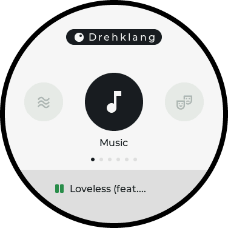 | 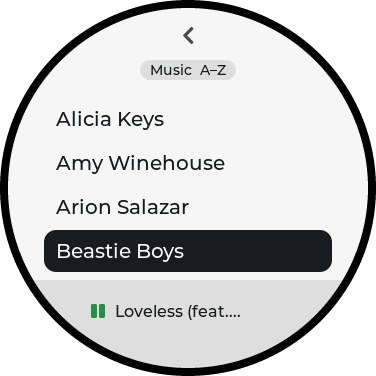 | 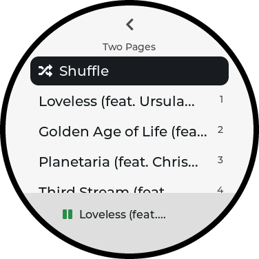 |
| **Now Playing** | **Options** | **Locked** |
| 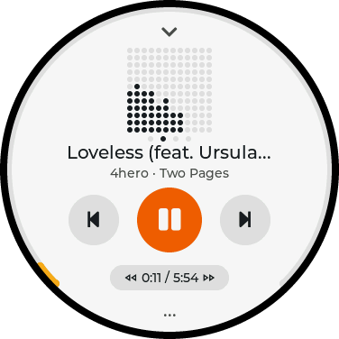 | 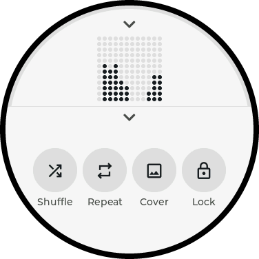 | 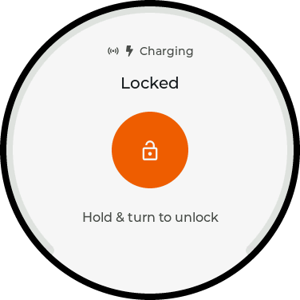 |
| **Tones** | **Tones, spectrum** | **Sleep timer** |
| 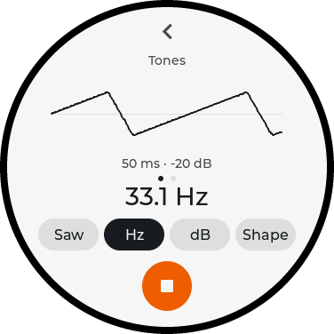 | 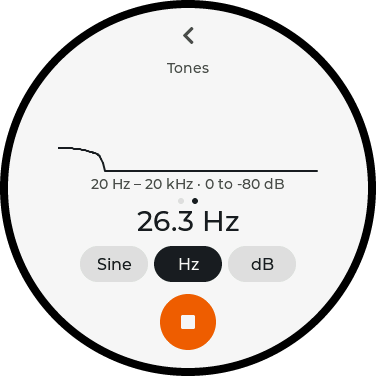 | 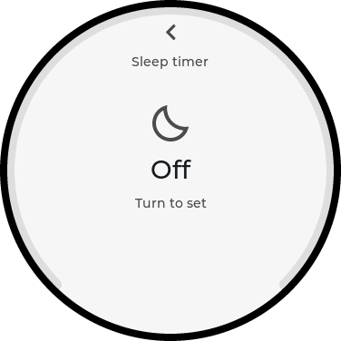 |
| **Settings** | **Bluetooth** | **About** |
| 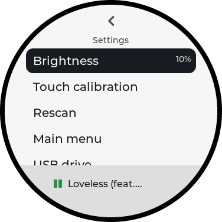 | 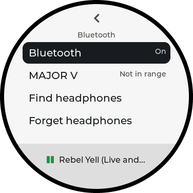 | 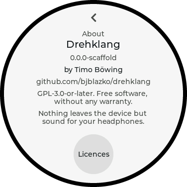 |
| **Table Tennis** | **Gravity** | |
| 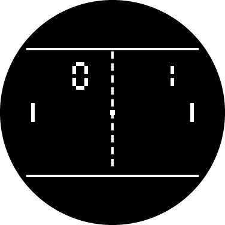 | 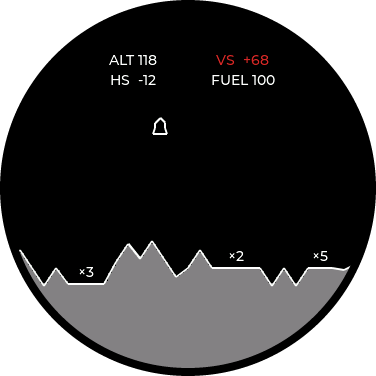 | |

## Contents

- [Features in detail](#features-in-detail)
- [Hardware](#hardware)
- [Preparing an SD card](#preparing-an-sd-card)
- [Flashing](#flashing)
- [Planned next](#planned-next)
- [Explicitly out of scope for now](#explicitly-out-of-scope-for-now)
- [Status](#status)
- [License](#license)

## Features in detail

See [`docs/design/ux-guidelines.md`](docs/design/ux-guidelines.md) for the
design philosophy, colour system and interaction flows behind the
screens.

- Play music stored on an SD card, in well-known formats.
- Audio output via the onboard 3.5mm jack (PCM5100A DAC).
- Control via the board's rotary encoder(s) + touch display.
- Fully offline for v1.
- Display power and device lock, tuned for two real usage contexts: on a
  table (display times out on its own, a touch wakes it without acting
  on whatever's underneath) and in a pocket while playing (manually
  locked so touch/knob can't trigger anything by accident; unlocking
  requires holding the on-screen unlock button while turning the
  encoder — see [ADR 0005](docs/adr/0005-power-lock-and-round-edge-indicators.md)).
  Song progress, volume and unlock progress are shown as rings hugging
  the round display's edge, via a small reusable widget.
- Battery level shown only when it matters: red with percentage at 20%
  or below, and always on the lock screen — see
  [ADR 0007](docs/adr/0007-battery-indicator.md) and
  [ADR 0008](docs/adr/0008-braun-design-system-and-screen-redesign.md).
- A Braun/Dieter-Rams-inspired visual design (warm off-white surface,
  one orange primary control per screen, tag titles, album cover and
  release years) — see
  [the UX guidelines](docs/design/ux-guidelines.md).
- A dot-matrix spectrum analyzer in Now Playing's cover slot: tap the
  cover to switch, shown by default when an album has no cover — see
  [ADR 0009](docs/adr/0009-now-playing-spectrum-analyzer.md).
  No charging indicator: the board exposes no charge-status signal (no
  dedicated pin, no voltage change on plug/unplug, no status LED).
- Collections: Music, Audiobooks and Radio Plays are separate shelves,
  each rooted at its own SD folder with its own index and browse
  position. They are the same player parameterised by a table row, not
  three players — spoken word simply has no shuffle, sorts by name and
  remembers where each title was left. The main menu is a knob carousel,
  and Settings > Main menu hides the shelves you do not have — see
  [ADR 0018](docs/adr/0018-collections-and-menu-visibility.md).
- Shuffle and repeat: a Shuffle row at the top of Music's Artists, Albums
  and Tracks lists shuffles the collection, the artist or the album.
  Toggles in Now Playing's options panel switch shuffle and repeat
  (off / all / one) — see [ADR 0011](docs/adr/0011-shuffle-and-repeat.md).
- Now Playing options panel: an ellipsis at the bottom opens a panel with
  shuffle, repeat, the cover/spectrum switch and lock, keeping the player
  itself uncluttered — see
  [ADR 0014](docs/adr/0014-now-playing-options-panel.md).
- Resume after power loss: the device comes back on the last screen with
  the last track paused near where it was (no auto-play). State is saved
  periodically and power-cut safe — see
  [ADR 0012](docs/adr/0012-resume-session.md).
- Per-title resume for spoken word: leave an audiobook for some music and
  a Continue row at the top of its parts brings you back to the spot.
  Several titles can be part-way through at once; tapping a part still
  plays that part from its start — see
  [ADR 0018](docs/adr/0018-collections-and-menu-visibility.md).
- Jog/shuttle: hold the time readout on Now Playing and turn the knob to
  fast forward or rewind (five speeds each way, CD-style cue); letting go
  plays on from there — see [ADR 0013](docs/adr/0013-jog-shuttle.md).
- M4A (AAC) plays natively with tags, exact durations and embedded covers;
  progressive JPEG covers decode too. Settings > USB drive exposes the
  SD card to a computer over the USB cable — see
  [ADR 0016](docs/adr/0016-native-formats-and-usb-drive.md).
- Ogg Vorbis plays too, through the same decoder library as everything
  else since [ADR 0026](docs/adr/0026-arduino-esp32-3-and-upstream-audioi2s.md).
  Embedded Ogg cover art (`METADATA_BLOCK_PICTURE`) isn't read; a folder
  `cover.jpg` still works.
- Settings > About (or a tap on the Drehklang wordmark on Home) shows the
  version, the author and the source address; its Licences button lists
  every component the firmware is built from, with its licence and
  required notices (full texts in `licenses/`).
- Tones, a tone generator: sine, square (duty), saw (rising → triangle →
  falling) and noise (brown, pink, white, blue, violet), 20 Hz – 20 kHz, level in dBFS independent of the
  volume, out of the 3.5 mm jack at 48 kHz. Chips pick what the knob
  sets; a live oscilloscope shows what actually reaches the DAC, on
  stepped scales so a doubled pitch or +6 dB is visibly doubled, and
  swiping it shows a spectrum. Its oscillator, scope and spectrum live in
  `lib/signal/`, built to be reused by a recorder and an analyzer — see
  [ADR 0024](docs/adr/0024-tone-generator.md).
- Bluetooth headphones, through the board's second chip (the ESP32-S3
  has no Classic Bluetooth): everything audible goes to them while the
  jack keeps playing, one volume for both, Play/Pause on the headphones,
  pairing from Settings > Bluetooth and reconnecting by itself. The
  second chip gets its own firmware (`bt/`, flashed with
  `scripts/flash-bt-mcu.sh`) — see
  [ADR 0027](docs/adr/0027-bluetooth-headphones.md).

## Hardware

Drehklang runs on the **Waveshare ESP32-S3-Knob-Touch-LCD-1.8**: an
ESP32-S3 with 8 MB PSRAM and 16 MB flash, a 360×360 round IPS display
with capacitive touch, a rotary knob, a PCM5100A DAC on a 3.5 mm jack, a
microSD slot and an optional battery. A second chip, an ESP32-U4WDH,
provides Classic Bluetooth. [`device.md`](device.md) has the pinout, the
quirks found on the way and the links to Waveshare's pages.

## Preparing an SD card

The card must be **FAT32 with 32 KB clusters** inside an **MBR partition**.
Both matter, and both were found the hard way (ADR 0016):

- **32 KB clusters** (`-c 64` = 64 sectors of 512 bytes). macOS reads the
  entire file allocation table when it mounts a drive, and does so at the
  USB cable's ~0.9 MB/s. With the usual 4 KB clusters a 32 GB card has a
  31 MB table, which takes longer than macOS waits: the card never
  mounts. At 32 KB the table is 3.9 MB and it mounts in a few seconds.
- **Don't use macOS Disk Utility's defaults.** A card formatted that way
  mounted but failed almost every file read on this board (see
  [AGENTS.md](AGENTS.md)). Format the partition directly with the
  commands below.
- Cards up to 32 GB are safest; 64 GB works too. Much larger cards push
  the table back into timeout territory even at 32 KB clusters.

Replace `diskN` / `sdX` with your card — **check twice, this erases it.**

**macOS** (`diskutil list` to find the disk):

```bash
diskutil partitionDisk /dev/diskN MBR "MS-DOS FAT32" DREHKLANG 100%
diskutil unmount /dev/diskNs1
sudo newfs_msdos -F 32 -c 64 -v DREHKLANG /dev/rdiskNs1
```

The first command creates the partition, the third replaces the
filesystem with one that has 32 KB clusters (`diskutil` alone can't set
the cluster size).

**Linux** (`lsblk` to find the device):

```bash
sudo parted /dev/sdX mklabel msdos
sudo parted -a optimal /dev/sdX mkpart primary fat32 4MiB 100%
sudo mkfs.vfat -F 32 -s 64 -n DREHKLANG /dev/sdX1
```

**Windows**: use [Rufus](https://rufus.ie) — Windows' own formatter
refuses FAT32 on cards above 32 GB, and its GUI doesn't offer 32 KB
clusters everywhere. In Rufus pick the card, "Non bootable", partition
scheme **MBR**, file system **FAT32**, cluster size **32 kilobytes**, then
Start. (On a card of 32 GB or less, `format F: /FS:FAT32 /A:32K /Q` in an
Administrator command prompt does the same.)

### "You don't have permission" in Finder

If the drive mounts but Finder refuses to open it, that is macOS's privacy
setting for removable media, not the card: recent macOS mounts FAT volumes
through FSKit, and Finder needs to be allowed to read them. Switch on
**System Settings > Privacy & Security > Files and Folders > Finder >
Removable Volumes**, or run `tccutil reset SystemPolicyRemovableVolumes`
and allow the prompt that appears the next time the drive is connected. A
terminal with full disk access can read the volume either way, which is a
quick way to tell this apart from a real filesystem problem.

### Copying music

Copy music as `Music/<Artist>/<Album>/<tracks>` — either with a card
reader (much faster for a first fill) or over the cable via
Settings > USB drive, at about 0.8 MB/s writing and 0.9 MB/s reading
(the ESP32-S3 has USB full speed only, whose practical ceiling is
~1.2 MB/s). That is roughly 2 minutes per album, or 9 hours for 26 GB.

## Flashing

The board has two chips behind one USB-C port, and **the way the plug is
turned decides which one you reach** (device.md):

```bash
scripts/flash-primary-mcu.sh   # Drehklang itself, on the ESP32-S3 (native USB)
scripts/flash-bt-mcu.sh        # the Bluetooth firmware, on the ESP32-U4WDH (CH340)
scripts/check.sh               # host tests and a firmware build, no board needed
```

Both scripts find the port and say when the plug needs turning. The
original firmware of both chips is backed up and can be restored with
`hardware-backups/restore.sh` (the images themselves are not in git).

## Planned next

- Less delay on Bluetooth headphones in games (~300 ms today; ADR 0027's
  open points)
- Wi-Fi: internet radio, and podcasts downloaded to the SD card

## Explicitly out of scope for now

- Other Wi-Fi features (time/date sync, weather)
- 24-bit FLAC and Opus: the decoder library plays both since ADR 0026,
  but the library scan doesn't list Opus files yet and neither has been
  checked on the device
- Cover art embedded in Ogg files (`METADATA_BLOCK_PICTURE`); folder
  `cover.jpg` covers already work
- Formatting the SD card from Settings with 32 KB clusters, which USB
  drive mode needs on macOS (ADR 0016)
- A desktop sync tool (mirror a folder to the knob, delete removed
  albums) on top of USB drive mode
- Theming (selectable color schemes / customizable look)
- General visual polish and animation ("eye candy") beyond the planned
  one-time gesture-hint nudge and screen-transition slide
- Voice memo / dictation recording via the onboard PDM microphone, and
  a spectrum analyzer (microphone or Drehklang's own output) -- both on
  `lib/signal/`'s oscillator, scope and `SampleSource` (ADR 0024)
- For Tones: a frequency sweep, stereo channel selection
- DOOM (v1 shareware, the WAD supplied on the SD card) via a prboom port,
  after the recorder and analyzer. Likely feasible on the S3's CPU and
  8 MB PSRAM; the real work is controls on one knob plus touch zones, the
  320x200 picture inside the round screen (~305x191 fits), and OPL music
  (skip at first). Start with a spike: the demo loop from SD, measured
  fps. The trademark needs a deliberate naming decision (cf. ADR 0022)
- A richer Now Playing screen (more detail/interactivity beyond the
  current controls + elapsed time)
- Using the rotary encoder as a jog dial for scrolling long lists/menus
  faster (beyond the current one-item-per-detent behavior)
- General UX polish pass once the above land and real usage patterns are
  clearer
- Charging state indicator (no signal available to detect it — see
  [ADR 0007](docs/adr/0007-battery-indicator.md))
- Shuffle for a Files-tab folder (library shuffle by album/artist/all
  exists, see ADR 0011; tapping a file still plays it alone)
- Volume normalization / ReplayGain-style loudness matching across
  tracks
- EQ presets (bass/treble/flat, etc.) built on the library's existing
  `setTone()` — see AGENTS.md's note on the volume-boost attempts before
  reusing it
- Favorites/playlists (marking tracks or albums for quick access)
- A "recently played" / "recently added" quick-access list
- Resume support for future sources (podcasts, web radio, video) — each
  adds its own section to the resume record, see ADR 0012
- Marking a spoken-word title finished, so its Continue row stops
  offering the end of the last part (`Bookmarks::forget()` is there,
  nothing calls it — ADR 0018)
- M3U playlist file import
- Gapless playback (for live albums, concept albums, etc.)
- On-device firmware updates from a file on the SD card (no Wi-Fi
  needed, fits the offline-first goal)
- More games beyond Table Tennis and Gravity (ADR 0022, ADR 0023) -- the
  Games list is a table a row wide, but each game is its own screen and
  its own rules. The two that still suit a knob and a round screen best,
  with names chosen to avoid the trademarks the originals carry:
  **Echo** (repeat a growing sequence of lit arcs -- the round display is
  the board, and the tone generator is already there) and **Snake** (the
  knob steers by turning rather than by pointing)
- Gravity's scrolling, magnifying landscape (ADR 0023). The arcade's
  world is wider than its screen and zooms in as you descend; here it is
  one screen, which at least means every pad is visible while you choose
  one
- Persisting any game's score across a reboot
- Difficulty levels for Table Tennis (one well-chosen AI speed cap is the
  whole design)
- A second player over the touch screen, so Table Tennis can be played
  the way the 1972 machines were

These are acknowledged future ideas, not requirements yet — don't design around them prematurely.

## Status

Hardware identified and documented. Process framework (ADRs, arc42,
coding guidelines, testing strategy) and toolchain skeleton (PlatformIO +
Arduino, native + esp32-s3 environments) are in place — see
[`docs/adr/`](docs/adr/README.md) and [`docs/arc42/arc42.md`](docs/arc42/arc42.md)
for what was decided and why.

v1 works on real hardware: browsing Music by artist, album, song, year or
genre (or by folder), jumping through long lists by initial letter,
playback with cover art, jog/shuttle, lock, sleep timer, resume, and
copying files over the USB cable. Formats are **MP3, M4A (AAC), WAV,
FLAC (16-bit) and Ogg Vorbis**. See
[ADR 0004](docs/adr/0004-navigation-library-and-index-architecture.md)
for the navigation/library architecture and the bring-up history,
[ADR 0016](docs/adr/0016-native-formats-and-usb-drive.md) for formats,
cover decoding and USB drive mode,
[ADR 0026](docs/adr/0026-arduino-esp32-3-and-upstream-audioi2s.md) for the
platform (Arduino-ESP32 3.x via pioarduino) and the decoder library, and
[ADR 0018](docs/adr/0018-collections-and-menu-visibility.md) for
collections and the main menu, and
[ADR 0019](docs/adr/0019-utf8-tag-text-and-project-text-fonts.md) for
UTF-8 tag decoding and the project's own text fonts, which is what lets
umlauts and accents render as written, and
[ADR 0021](docs/adr/0021-jump-by-letter-and-music-browse-axes.md) for
jump-by-letter and Music's browse axes, and
[ADR 0024](docs/adr/0024-tone-generator.md) for the tone generator, and
[ADR 0027](docs/adr/0027-bluetooth-headphones.md) for Bluetooth
headphones.

### What goes on the SD card

Each collection is its own top-level folder, laid out
`<root>/<Artist>/<Album>/track` (for spoken word: `<series>/<title>/part`
— tags win where they exist, folder names are the fallback):

```
/Music/…         Music
/Audiobooks/…    Audiobooks
/RadioPlays/…    Radio Plays
/drehklang/        indexes and cached covers (written by the device)
```

A collection whose folder is missing simply shows up empty; hide it in
Settings > Main menu if you do not want it on the home screen. Indexes are
built on demand — Settings > Rescan, or automatically after a USB drive
session — never at boot, so the device is usable the moment it powers on.

## License

Drehklang is licensed under **GPL-3.0-or-later** — see [LICENSE](LICENSE).
The Bluetooth firmware (`bt/`, `lib/btlink/`, `lib/btaudio/`) carries an
additional permission to link Espressif's binary-only Bluetooth libraries
— see [LINKING-EXCEPTION.md](LINKING-EXCEPTION.md).

That follows from the audio library: ESP32-audioI2S is GPL-3.0, so
firmware linking it is covered as a whole. [THIRD-PARTY.md](THIRD-PARTY.md)
lists every component and its licence, and explains where M4A/AAC decoding
comes from (FAAD2, inside that same library) and how
its patent situation looks — Drehklang ships no decoder of its own.
